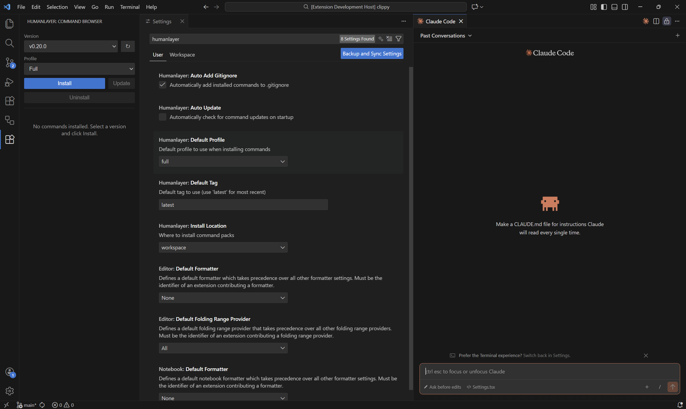

# HumanLayer Command Syncer

[](https://marketplace.visualstudio.com/items?itemName=daedalus-apps.humanlayer-command-syncer)
[](https://marketplace.visualstudio.com/items?itemName=daedalus-apps.humanlayer-command-syncer)
[](https://opensource.org/licenses/MIT)

> **Sync HumanLayer command packs for Claude Code with one click.**

A VS Code extension that automatically fetches, installs, and updates HumanLayer's Claude Code command packs directly from the official HumanLayer repository.



> **For Claude Code Users**: This extension is designed for users running [Claude Code](https://claude.ai/code) (Anthropic's official CLI) within VS Code. It manages command packs for Claude Code's slash command system.

---

## Features

| Feature | Description |
|---------|-------------|
| **One-Click Install** | Fetch and install HumanLayer commands from GitHub instantly |
| **Automatic Updates** | Get notified when new command versions are available |
| **Version Pinning** | Pin to specific tags or always use the latest release |
| **Profile Support** | Choose between minimal, full, or custom command sets |
| **Offline Mode** | Works offline using cached commands |
| **User or Workspace** | Install globally (`~/.claude`) or per-project |
| **Safe Updates** | Preview changes before applying |
| **Git-Friendly** | Automatically adds commands to `.gitignore` |

---

## Quick Start

1. **Install** the extension from the VS Code Marketplace
2. **Open** the HumanLayer panel in the sidebar (look for the HumanLayer icon)
3. **Select** a version from the dropdown
4. **Click** "Install"

That's it! Your commands are ready to use in Claude Code.

---

## Usage

### Installing Commands

1. Open the HumanLayer panel in the sidebar
2. Select a version from the dropdown
3. Choose a profile (minimal/full/custom)
4. Click "Install"

Commands are installed to `.claude/commands/humanlayer/` in your workspace (or `~/.claude/commands/humanlayer/` for user-level installation).

### Updating Commands

1. The extension automatically checks for updates
2. When an update is available, a notification appears
3. Click "Update" to preview and apply changes

### Removing Commands

1. Open the HumanLayer panel in the sidebar
2. Click the "Uninstall" button
3. Confirm the removal when prompted

The `.claude/commands/` folder is preserved since it may contain other commands.

### Command Palette

| Command | Description |
|---------|-------------|
| `HumanLayer: Install Commands` | Install or reinstall commands |
| `HumanLayer: Update Commands` | Check and apply updates |
| `HumanLayer: Open Command Browser` | Open the HumanLayer panel |
| `HumanLayer: Check for Updates` | Manually check for updates |

---

## Configuration

| Setting | Default | Description |
|---------|---------|-------------|
| `humanlayer.autoUpdate` | `false` | Automatically check for updates on startup |
| `humanlayer.defaultProfile` | `"full"` | Default profile (minimal/full/custom) |
| `humanlayer.autoAddGitignore` | `true` | Add installed commands to .gitignore |
| `humanlayer.defaultTag` | `"latest"` | Default version tag |
| `humanlayer.installLocation` | `"workspace"` | Where to install: `"workspace"` or `"user"` |

### Installation Locations

| Location | Path | Best For |
|----------|------|----------|
| **Workspace** (default) | `.claude/commands/humanlayer/` | Project-specific commands |
| **User** (global) | `~/.claude/commands/humanlayer/` | Commands used everywhere |

The panel shows a banner indicating where commands are installed.

---

## How It Works

```
┌─────────────────┐     ┌──────────────┐     ┌─────────────────┐
│  GitHub Repo    │────▶│   Validate   │────▶│  Install to     │
│  (HumanLayer)   │     │   (YAML)     │     │  .claude/       │
└─────────────────┘     └──────────────┘     └─────────────────┘
                                                     │
                                                     ▼
                                            ┌─────────────────┐
                                            │  Create lockfile│
                                            │  + .gitignore   │
                                            └─────────────────┘
```

1. **Fetches** command packs from the HumanLayer GitHub repository
2. **Validates** YAML syntax and schema
3. **Installs** commands to your chosen location
4. **Creates** a lockfile for reproducible installs
5. **Updates** `.gitignore` (workspace installations only)

---

## File Structure

### Workspace Installation

```
your-project/
└── .claude/
    └── commands/
        └── humanlayer/
            ├── command1.md
            ├── command2.yaml
            └── humanlayer.lock.json
```

### User Installation

```
~/.claude/
└── commands/
    └── humanlayer/
        ├── command1.md
        ├── command2.yaml
        └── humanlayer.lock.json
```

---

## Offline Mode

When GitHub is unavailable, the extension automatically:
- Uses cached commands from the last successful fetch
- Shows only versions that are cached locally
- Displays an offline indicator in the panel

---

## Requirements

- VS Code 1.85.0 or higher
- Internet connection (for initial install and updates)

---

## Development

### Setup

```bash
git clone https://github.com/franciszver/claude-humanlayer-extension
cd claude-humanlayer-extension
npm install
npm run compile
```

### Running Locally

1. Open the project in VS Code
2. Press **F5** to launch the Extension Development Host
3. The extension will be active in the new VS Code window

### Scripts

| Script | Description |
|--------|-------------|
| `npm run compile` | Compile TypeScript |
| `npm run watch` | Watch mode for development |
| `npm run test` | Run unit tests |
| `npm run lint` | Run ESLint |
| `npm run package` | Create .vsix package |

---

## Contributing

Contributions are welcome! Please open an issue or submit a pull request on [GitHub](https://github.com/franciszver/claude-humanlayer-extension).

---

## License

MIT

---

## Links

- [HumanLayer Command Packs](https://github.com/humanlayer/humanlayer)
- [Report Issues](https://github.com/franciszver/claude-humanlayer-extension/issues)
- [VS Code Marketplace](https://marketplace.visualstudio.com/items?itemName=daedalus-apps.humanlayer-command-syncer)
