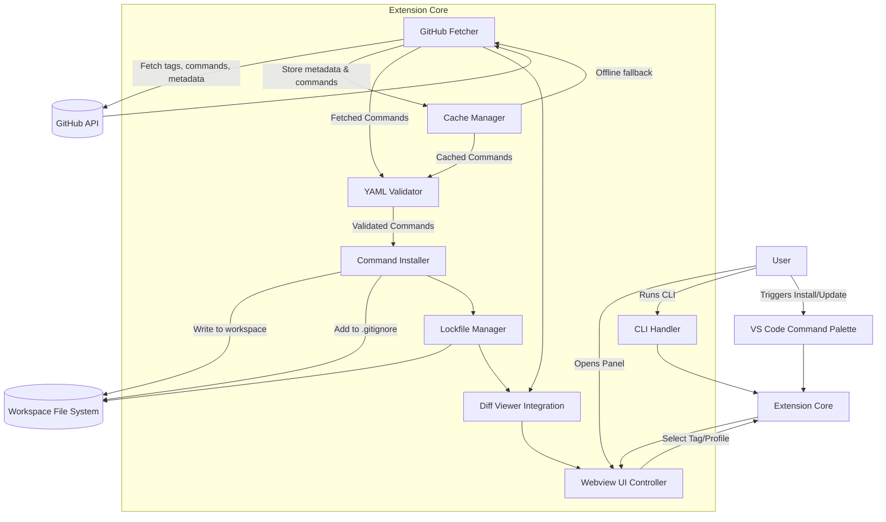
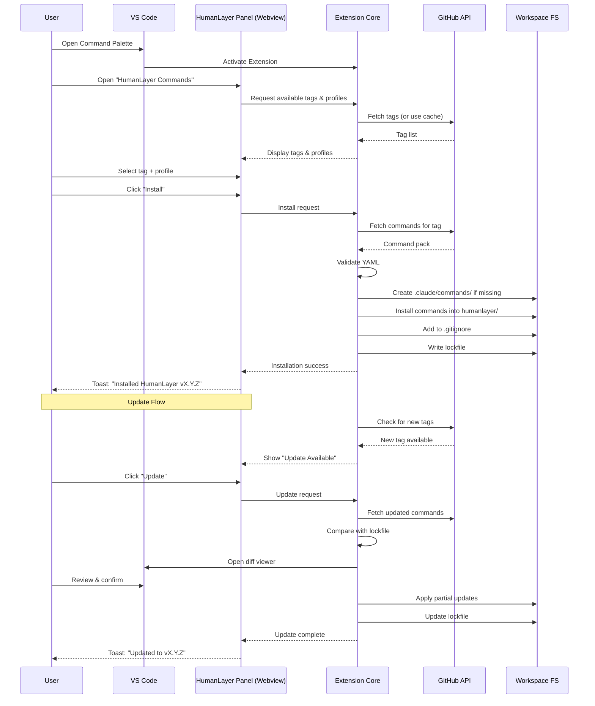
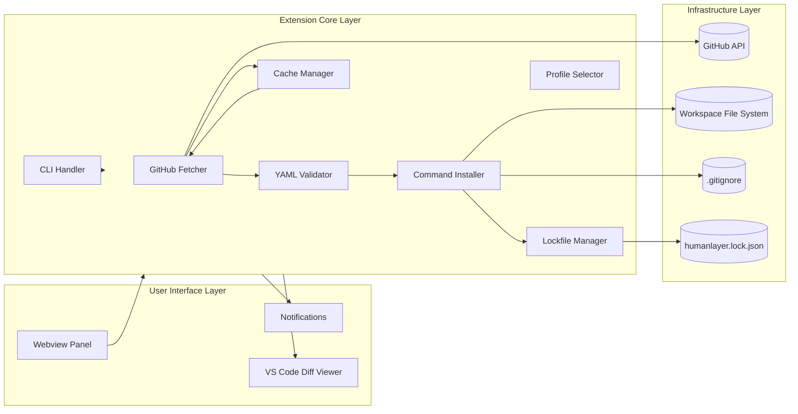

```markdown
# Architecture: HumanLayer Command Syncer  
**Version:** 0.1  
**Author:** Francis de Guzman  
**Purpose:** Provide a high‑level architectural overview of the HumanLayer Command Syncer extension, including information flow and user experience, expressed through Mermaid diagrams.

---

# 1. System Architecture (Information Flow)



---

# 2. User Experience Flow (End‑to‑End)



---

# 3. Component Overview Diagram



---

# 4. Summary

This architecture captures:

- **Information flow** between GitHub, the extension core, the workspace, and the UI  
- **User experience flow** from installation to updates  
- **Component responsibilities** and how they interact  
- **Support for multi-root workspaces, offline mode, profiles, lockfiles, and diffing**  

It reflects the PRD, Approach, and Resources documents and provides a clear blueprint for implementation.

```

---

