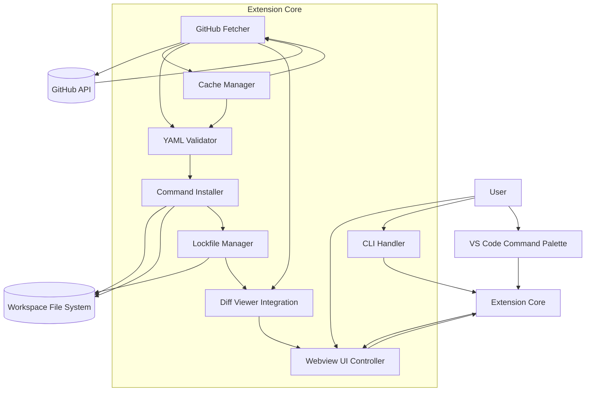
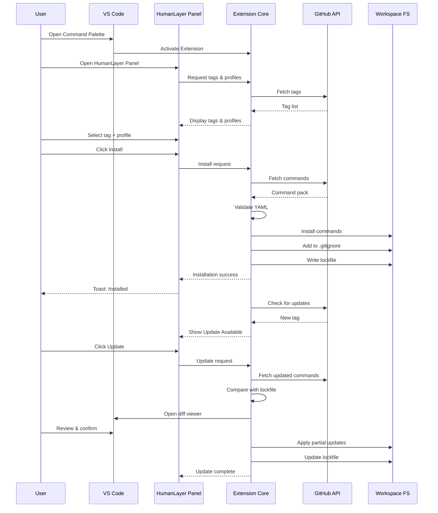

```markdown
# ASP: All‑Systems Prompt for HumanLayer Command Syncer  
**Version:** 1.0  
**Author:** Francis de Guzman  
**Purpose:** This document is the single, unified prompt containing the full Product Requirements, Development Approach, Resources, and Architecture for generating the entire HumanLayer Command Syncer VS Code extension in one shot.

---

# ============================
# 1. PRODUCT REQUIREMENTS (PRD)
# ============================

## 1. Overview

HumanLayer Command Syncer is a VS Code extension that automatically fetches, installs, and updates HumanLayer’s Claude Code command packs directly from the official HumanLayer repository. It removes the need for manual cloning, copying, and YAML management.

The extension installs commands at the **workspace level**, ensuring project‑specific workflows while keeping repositories clean by **preventing these generated files from being committed**. Installed commands are treated as **dependencies**, not source code, and are automatically added to `.gitignore`.

The MVP focuses **exclusively on `.claude/commands/`**.

---

## 2. Problem Statement

HumanLayer publishes a rich set of prompts and slash commands inside `.claude/commands/`, but:

- Users must manually clone the repo  
- Commands must be manually copied  
- Updates require manual pull + copy  
- No UI exists for browsing or selecting commands  
- Teams cannot standardize or sync commands  
- Commands often get accidentally committed  

This friction slows adoption.

---

## 3. Goals & Non‑Goals

### Goals
- Fetch HumanLayer commands directly from GitHub  
- Install into workspace `.claude/commands/humanlayer/`  
- Treat installed commands as dependencies  
- Auto‑add to `.gitignore`  
- Provide UI for browsing, enabling, disabling, updating  
- Validate YAML  
- Support version pinning to tags  
- Maintain per‑folder lockfile  
- Support offline mode  
- Provide CLI for install/update/diff  
- Support HumanLayer‑defined profiles  
- Use VS Code diff viewer  
- Rename files to disable commands  
- Multi‑root support (install into each folder containing `.claude/`)  

### Non‑Goals
- No agents or hooks (post‑MVP)  
- No modifying HumanLayer prompts  
- No overriding Claude Code built‑ins  
- No machine‑to‑machine sync  
- No third‑party repos (future)

---

## 4. Source Repository Details

Source: https://github.com/humanlayer/humanlayer  
Relevant directories:  
- `.claude/commands/`  
- `CLAUDE.md`  
- `test-slash-commands.md`

---

## 5. Core Features

### GitHub Integration
- Fetch commands from tags  
- Cache metadata  
- Support offline fallback  

### Workspace Installation
- Install into `.claude/commands/humanlayer/`  
- Auto‑create directories  
- Auto‑add to `.gitignore`  
- Multi‑root: install into each folder with `.claude/`  

### UI Panel (Webview)
- Command list  
- Previews  
- Tag selector  
- Profile selector  
- Update indicators  
- Enable/disable toggles  

### YAML Validation
- Schema validation  
- Duplicate detection  
- Missing fields  
- User‑modified detection  

### Update System
- Tag comparison  
- Partial updates  
- Built‑in diff viewer  
- Rollback via version selector  
- Tag‑level changelog (command diffs only)

### Lockfile
Stored at:  
`.claude/commands/humanlayer.lock.json`

Contains:
```json
{
  "tag": "v1.2.0",
  "profile": "minimal",
  "commands": [
    { "name": "summarize", "path": "...", "hash": "..." }
  ],
  "timestamp": "..."
}
```

Lockfile is **not committed**.

### Offline Mode
- Use cached commands  
- Warn user  
- Allow retry or proceed  

### CLI
```
code --humanlayer install --tag vX.Y.Z
code --humanlayer update
code --humanlayer diff
code --humanlayer profile minimal
```

### Telemetry
- Errors only  
- No identifiers  

---

## 6. Architecture Components

- GitHub Fetcher  
- YAML Validator  
- Command Installer  
- Lockfile Manager  
- Cache Manager  
- Webview UI Controller  
- Diff Viewer Integration  
- CLI Handler  

---

## 7. User Flows

### First‑Time Install
1. User opens panel  
2. Selects tag + profile  
3. Clicks Install  
4. Fetch → validate → install → ignore → lockfile  

### Update Flow
1. Extension detects new tag  
2. User clicks Update  
3. Diff viewer opens  
4. Partial update applied  
5. Lockfile updated  

### Multi‑Root
- Install into each folder containing `.claude/`  
- Each folder has its own lockfile  

### Offline Mode
- Retry / use cache / cancel  

---

## 8. Configuration Options
- Tag selector  
- Profile selector  
- Auto‑update toggle  
- Auto‑add to `.gitignore`  
- Offline mode behavior  

---

## 9. Testing Requirements
- GitHub API mocks  
- YAML validation  
- Conflict detection  
- Multi‑root behavior  
- `.gitignore` handling  
- UI tests  
- Update flow  
- Lockfile integrity  
- Offline mode  
- CLI  

---

## 10. Future Enhancements
- Agents & hooks  
- Private repos  
- Export/import config  
- Team sync  
- HumanLayer marketplace  

---

# ============================
# 2. DEVELOPMENT APPROACH
# ============================

## Phase 1 — Core Foundation
- Extension scaffolding  
- GitHub fetcher (tags)  
- Workspace installer  
- YAML validation  
- Lockfile (minimal)  

## Phase 2 — UI Layer
- Webview panel  
- Command list + previews  
- Tag selector  
- Profile selector  
- Notifications  

## Phase 3 — Update System
- Update detection  
- Partial updates  
- Diff viewer integration  
- Rollback  

## Phase 4 — Advanced Behavior
- Offline mode  
- User‑modified handling  
- Disable command support  
- Multi‑root enhancements  

## Phase 5 — CLI
- Install/update/diff/profile  
- JSON output  
- Dry‑run mode  

## Phase 6 — Polish & Release
- Error handling  
- Performance  
- Documentation  
- Marketplace release  

## Phase 7 — Post‑MVP
- Agents & hooks  
- Private repos  
- Export/import  
- Team sync  

---

# ============================
# 3. RESOURCES
# ============================

## HumanLayer Repository
- Source of commands  
- Required for tags, diffs, metadata  

## GitHub API
- Fetch tags  
- Fetch command packs  
- Fetch diffs  
- Cache fallback  

## VS Code API
- File system  
- Webview  
- Diff viewer  
- CLI  
- Notifications  

## YAML Parser
- Schema validation  
- Conflict detection  

## Lockfile System
- Reproducibility  
- Partial updates  
- Offline mode  

## Cache Directory
- Faster fetches  
- Offline fallback  

## Webview Framework
- UI panel rendering  

## Diff Tools
- VS Code built‑in diff viewer  

## CLI Integration
- Automation  
- CI/CD  

## Testing Tools
- Jest/Vitest  
- Playwright  
- Nock/MSW  

## Publishing Tools
- `vsce`  
- Publisher ID  
- PAT  

---

# ============================
# 4. ARCHITECTURE (MERMAID)
# ============================

## 4.1 System Architecture (Information Flow)



---

## 4.2 User Experience Flow



---

# ============================
# 5. INSTRUCTIONS FOR THE LLM
# ============================

Using this **ASP.md**, generate the complete VS Code extension including:

- Full folder structure  
- All TypeScript source files  
- Webview UI implementation  
- GitHub fetcher  
- YAML validator  
- Installer logic  
- Lockfile manager  
- Cache system  
- CLI integration  
- Multi‑root support  
- Offline mode  
- Diff viewer integration  
- All configuration schemas  
- Tests (unit + integration)  
- package.json  
- README.md  
- Icon placeholder  
- Marketplace‑ready assets  

The output should be a **complete, ready‑to‑build extension**.

```
